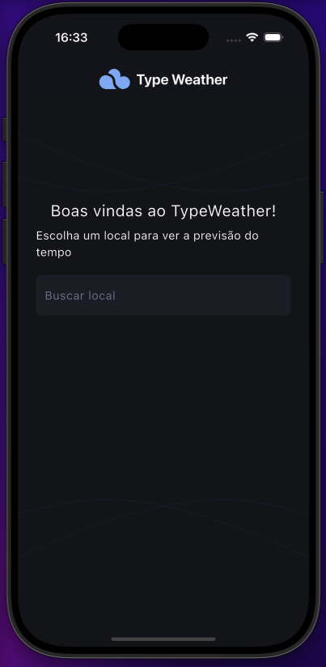
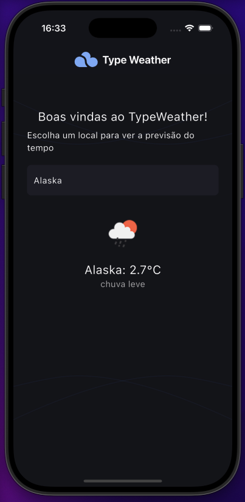

# 🌤️ TypeWeather

**TypeWeather** é um aplicativo Flutter simples que exibe a previsão do tempo atual para qualquer cidade, utilizando a API gratuita do [OpenWeatherMap](https://openweathermap.org/api). A [interface](https://www.figma.com/design/hgrWfopHmKbFPKjHtUId6L/TypeWeather--Community-?node-id=3-376&p=f&t=ygYZVPZXfWLx8KUE-0) é moderna, minimalista e projetada para dispositivos móveis.

## 📱 Telas

### Tela Inicial



### Resultado da Busca



## ⚙️ Funcionalidades

- Pesquisa de clima por cidade
- Exibição da temperatura, descrição e ícone do clima atual
- Interface responsiva e com visual limpo
- Consumo de API externa (OpenWeatherMap)
- Suporte a `.env` para manter a chave da API segura

## 🛠️ Como rodar o projeto

### 1. Clone o repositório

```bash
git clone https://github.com/Zilla3k/flutter_tpwtr.git
cd flutter_tpwtr
```

### 2. Instale as dependências

```bash
flutter pub get
```

### 3. Configure a chave da API

Crie um arquivo chamado .env na raiz do projeto e adicione a seguinte linha:

```bash
OPENWEATHER_API_KEY=sua_chave_aqui
```

⚠️ Importante: não compartilhe sua chave. Esse arquivo já está incluído no .gitignore.

Garanta também que o .env está listado no pubspec.yaml:

flutter:
assets: - .env

### 4. Execute o projeto

```bash
flutter run
```

📦 Tecnologias utilizadas

- Flutter
- OpenWeatherMap API
- flutter_dotenv
- http

🔐 Segurança
Este projeto usa flutter_dotenv para proteger variáveis sensíveis como a chave da API. O arquivo .env não é versionado, e um exemplo de configuração pode ser visto em api_service.dart.

🧪 Compatibilidade

- Flutter 3.19
- iOS 18.3
